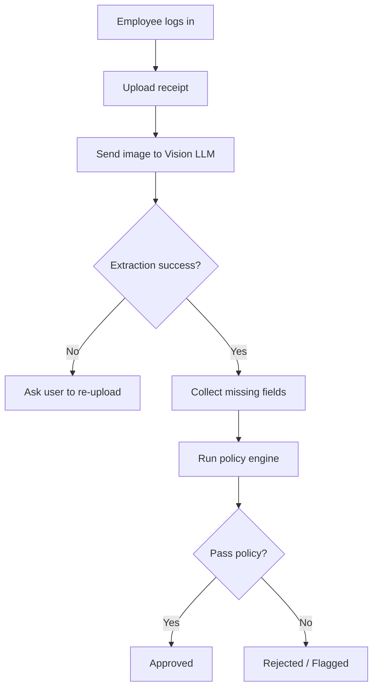

# PRD - Smart Expense Reimbursement System

## 1. Overview
An intelligent web-based expense reimbursement platform that automates receipt submission, OCR extraction, categorization, and policy validation using a Vision LLM.

## 2. Problem Statement
Traditional employee expense reimbursement processes are manual, slow, error-prone, and consume time for both employees and finance teams.

## 3. Goal / Value Proposition
Build a smart system that:
- Scans receipts in real time
- Extracts structured data automatically
- Categorizes expenses
- Validates expenses against company policy
- Returns instant approval / rejection / flagged status

## 4. Target Users
### Primary Users
- Employees submitting expenses

### Secondary Users
- Finance managers reviewing exceptions and violations

## 5. Core Features
### Functional Requirements
- Upload receipt images (JPG, PNG) from mobile gallery or camera
- Send image to Vision LLM API
- Extract:
  - Total amount
  - Currency
  - Purchase date
  - Merchant name
- Auto classify category:
  - Travel
  - Meals
  - Office supplies
- Manual completion of missing fields
- Policy engine validation
- Final status output:
  - Approved
  - Rejected
  - Flagged
- Clear explanation for violations

## 6. Non Functional Requirements
- Processing time: 5-10 seconds max
- Data extraction accuracy: 90%+
- Responsive web app (mobile + desktop)
- Graceful handling of API failures / rate limits
- Secure storage for uploaded receipts
- Protected API communication

## 7. Out of Scope
- Payment transfers
- Real reimbursements processing
- Handwritten receipt parsing

## 8. User Flow
1. Employee logs in
2. Clicks Add New Expense
3. Uploads receipt image
4. System sends image to Vision LLM
5. Extracted data displayed
6. User completes missing fields if required
7. Policy engine validates request
8. Final decision shown

## 9. Example Decisions
- Approved
- Rejected: Missing required client name for business meal
- Flagged: Amount exceeds meal threshold

## 10. Tech Stack
- Frontend: Responsive Web App
- Backend: FastAPI (Python)
- Database: PostgreSQL
- ORM: SQLAlchemy
- Package Manager: uv
- AI Layer: Vision LLM API
- Storage: Secure object storage

## 11. Suggested Backend Architecture
- routes/
- services/
- repositories/
- models/
- schemas/
- core/
- integrations/ai/

## 12. Milestones
1. Finalize requirements
2. Integrate Vision API
3. Build policy engine
4. Build web UI + DB
5. QA + bug fixing + launch

## 13. KPIs
- OCR accuracy > 90%
- Fast response latency
- % Auto approved expenses
- % Flagged expenses
- Most violated policy rules

## 14. Mermaid Flowchart

